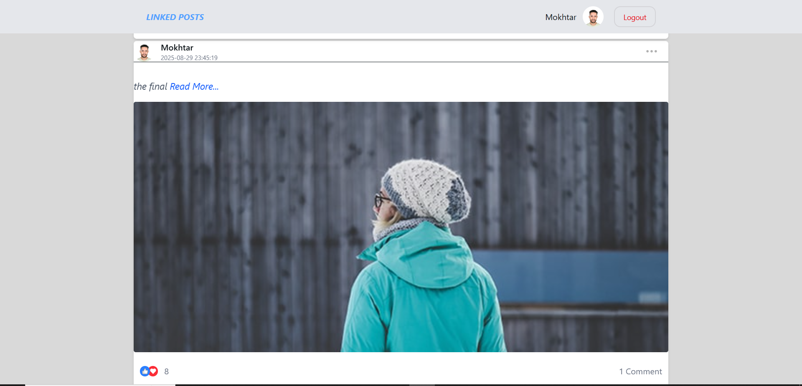

# 🎯 Linked Posts - Social Media React Project

This is a responsive React application that allows users to create posts, comment, and interact with a social feed. The project demonstrates a modern front-end workflow using React, HerUI, React Hook Form, and Zod for validation.

---

## 📸 Preview

---

## 📁 Features

- User authentication (login/logout)
- Create, edit, and delete posts
- Upload images for posts and comments
- Comment system with edit/delete
- Form handling and validation using **React Hook Form** and **Zod**
- Responsive design for desktop and mobile

---

## 🛠️ Technologies Used

- **React**
- **Vite**
- **HerUI**
- **React Hook Form**
- **Zod** (form validation)
- **Axios & FormData**
- **React Router DOM**
- **React Context API**
